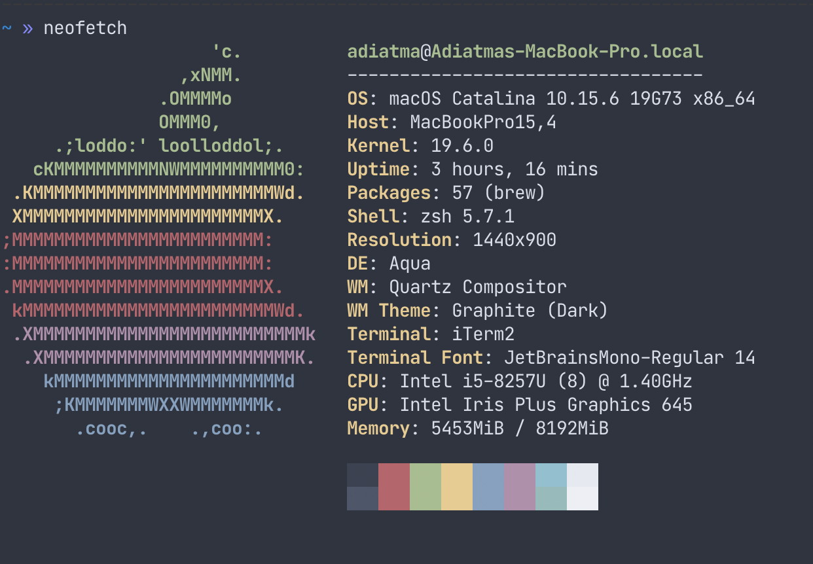
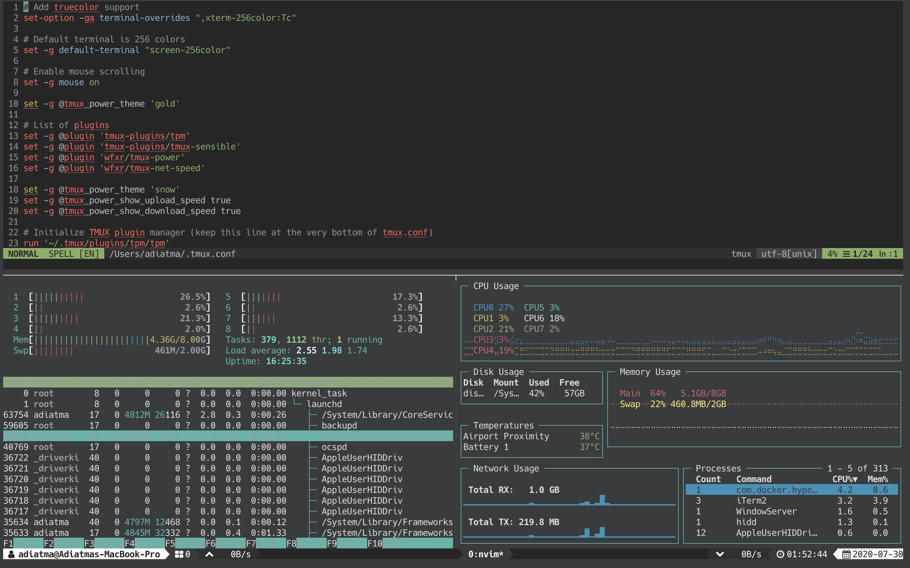

# Dotfiles

Hello world, welcome to my `.(dotfiles)` setup, to store setup in git repository i'm using [yadm](https://yadm.io/).

## Tools

- neovim
- brew
- tmux
- iTerm2
- oh-my-zsh
- android-studio
- flipper
- gpg

## Theme
- tmux-powerline-theme (tmux)
- spaceship (oh-my-zsh)
- nvim (edge)

